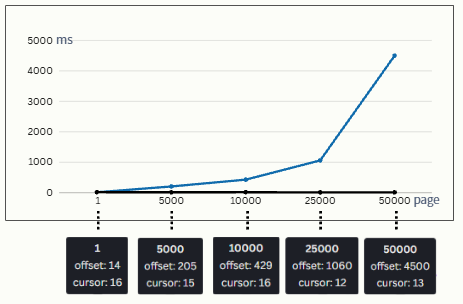

# LookUp

Offset, Cursor 방식의 조회 성능을 비교해보는 코드입니다.

  

- 성능 측정 도구 및 데이터
  - Postman
  - Data 500,000 개
- 테스트 환경
  - Local 환경에서 테스트를 진행했습니다.
  - 조회 쿼리에 3개의 조인 쿼리가 있습니다.
  - 조회 위치에서의 성능 차이를 비교하기 위해서 페이지 위치를 다르게 하여 총 5번의 테스트를 진행했습니다.

- OFFSET 페이징 성능 측정 결과
  - 첫번째 페이지나 페이지 초반 검색은 cursor 조회와 성능차이가 없었습니다.
  - 500 번째 페이지에선 32 ms 로 cursor 조회보다 약 2배가량 성능이 저하됨을 확인했습니다.
  - 페이지가 늘어갈수록 선형적으로 성능이 감소함을 결과로 확인했습니다.

- CURSOR 페이징 성능 측정 결과
  - offset 조회 방식과 성능 비교를 위해 같은 조건 하에서 같은 데이터 값들을 대상으로 총 5번의 테스트를 진행했습니다.
  - offset 방식과 다르게 페이지가 늘어도 성능저하가 없음을 확인했습니다.

- 응답 속도 성능 결과
  - 뒤 페이지로 갈수록 최대 99.7% 의 응답속도 감소의 차이를 확인했습니다.
  - 원하는 페이지로 이동하기에는 까다롭지만 서비스의 특성을 고려한 후 도입에 문제가 없다면 기존의 조회 성능을 상당 부분 개선할 수 있을것이라고 생각됩니다.
